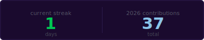

<p align="center">
  
</p>

```
  prithvi@void ~ % whoami

  prithvi hegde
  ──────────────────────────────────────────────────
  interests  →  ai · machine learning · math · cs
  approach   →  read deeply · build iteratively
  ──────────────────────────────────────────────────
```

<br/>

<p align="center">
  
</p>

<br/>

<p align="center">
  <a href="https://www.linkedin.com/in/prithvi-hegde-24b3b430b/">
    
  </a>
</p>
