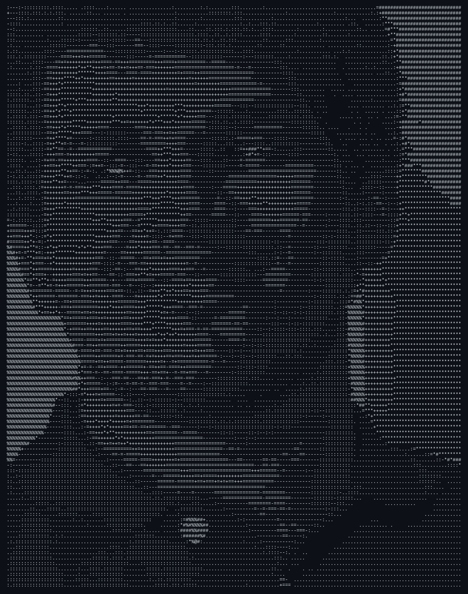

```
penitant@arch:~$ fastfetch
```

<table>
<tr>
<td width="240" valign="top">

</td>
<td valign="top">

```
prithvi@penitant
----------------
OS: Arch Linux x86_64
Role: Computer Science Student
Focus: Machine Learning / Systems Programming
Under The Hood: low-level design -> AI arch
Editor: nvim
Shell: fish
Environment: Linux, developer tooling
Projects: scalable, practical engineering
Ethos: theory bridged with real-world impact
Community: collaboration, talks, learning
Beyond Code: volunteering, social causes
Uptime: penance ongoing

Contact: prithvih.workwithme@gmail.com
LinkedIn: /in/prithvi-hegde-24b3b430b
```

</td>
</tr>
</table>

```
penitant@arch:~$ nvim ~/notes/motives.md

   1 │ # what the fetch leaves out
   2 │
   3 │ i like understanding how things work under the hood — from
   4 │ low-level system design up to modern AI architectures.
   5 │
   6 │ most of what i build starts as curiosity: pulling a system
   7 │ apart to see why it holds together, then rebuilding it a
   8 │ little cleaner than i found it.
   9 │
  10 │ outside the terminal, i put the same energy into community
  11 │ work — volunteering and initiatives meant to create some
  12 │ small, real change.
   ~
   ~
  ──────────────────────────────────────────────────────────
   NORMAL │ motives.md │ 12L │ md │ utf-8 │ unix        12:1
  ──────────────────────────────────────────────────────────
  :wq

penitant@arch:~$ █
```
