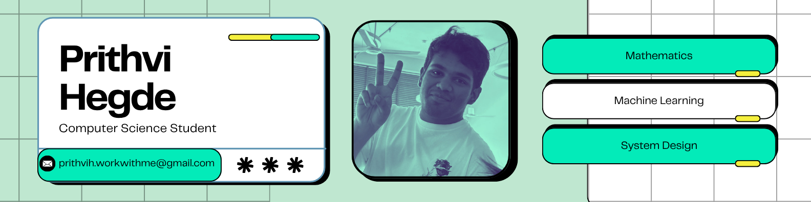

<p align="center">
  
</p>

<br/><br/>

```console
penitant@arch:~$ whoami
prithvi hegde

penitant@arch:~$ nvim about.txt

   1 │ Computer Science student with a strong interest in Machine
   2 │ Learning, Systems Programming, and building scalable software.
   3 │ Passionate about understanding how things work under the hood,
   4 │ from low-level system design to modern AI architectures.
   5 │
   6 │ Enjoy exploring Linux ecosystems, developer tooling, and
   7 │ practical engineering projects that bridge theory with
   8 │ real-world impact. Actively involved in technical communities,
   9 │ collaborative projects, and initiatives that encourage
  10 │ innovation and learning.
  11 │
  12 │ Outside academics — volunteering for social causes and
  13 │ contributing to community-driven efforts that create
  14 │ meaningful change.
   ~
   ~
   ~
  ───────────────────────────────────────────────────────────────
   NORMAL │ about.txt │ 14L │ utf-8 │ unix                  14:1
  ───────────────────────────────────────────────────────────────
  :wq

penitant@arch:~$ █
```

<p align="center">
  <a href="mailto:prithvih.workwithme@gmail.com">email</a>
  &nbsp;·&nbsp;
  <a href="https://www.linkedin.com/in/prithvi-hegde-24b3b430b/">linkedin</a>
</p>
